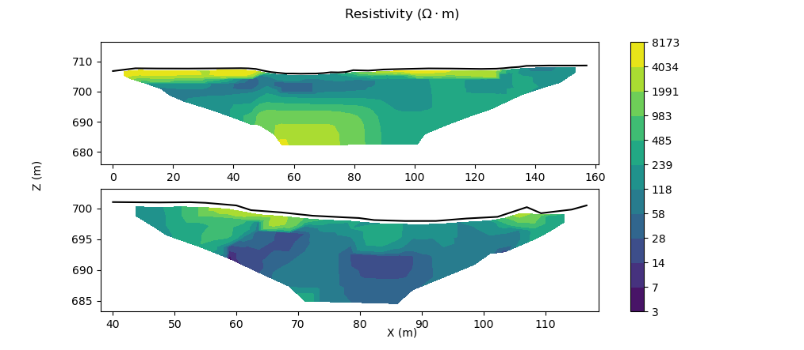

# ERTplot
An alternative to RES2DINV's ugly plotting functionality.

ERTplot.py is a script that plots 2D electrical resistivity tomography (ERT) data with much more versatility than RES2DINV allows.

Please modify at will and send a pull request if you have ideas. :)

## What it does
- Reads in an .xls/.xlsx file with X,Z,Res data (exported from RES2DINV, for example) and topography data (e.g. from GNSS survey)
- Plots this data with user-selected colour scheme, number of levels, values of levels, etc.

## What it doesn't do
- Invert raw ERT data from your terrameter.

## Example output

